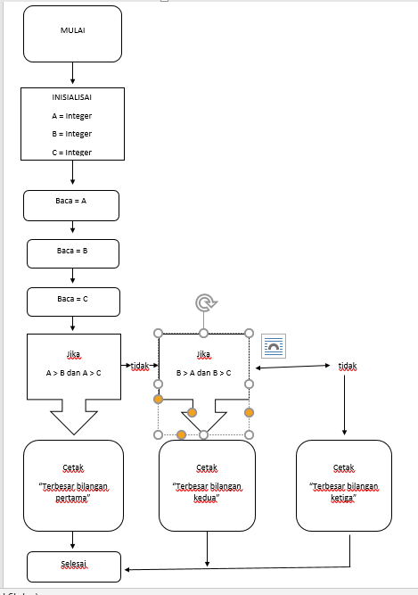

# Program menentukan bilangan terbesar dari 3 bilangan yang diinputkan <h1>

* Mulai
* Inisialisasi A, B, C
* Baca A
* Baca B
* Baca C
* Jika A > B dan A > C Maka Cetak A terbesar
* Jika tidak, B > A dan B > C Maka Cetak B terbesar
* Jika tidak, C Maka Cetak terbesar

# Flowchart menentukan bilangan terbesar dari 3 bilangan yang diinputkan <h1>

# Hasil program dan Hasil Eksekusi <h2>
* **Program setelah dibuat dari Algoritma di atas**

* **Inisialisasi dan input**

* **Percabangan**

# Hasil terbesar dalam 3 kondisi berbeda <h2>
* **Hasil terbesar Bilangan pertama**

* **Hasil terbesar Bilangan kedua**

* **Hasil terbesar Bilangan ketiga**

